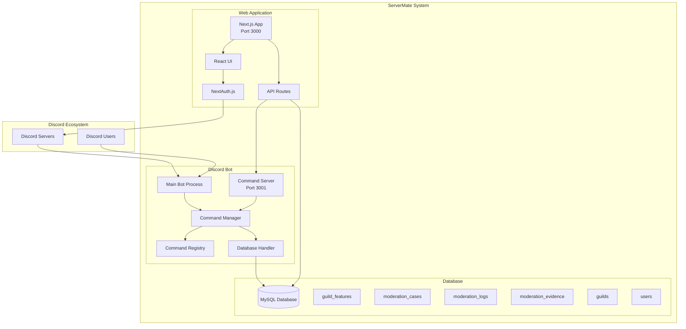
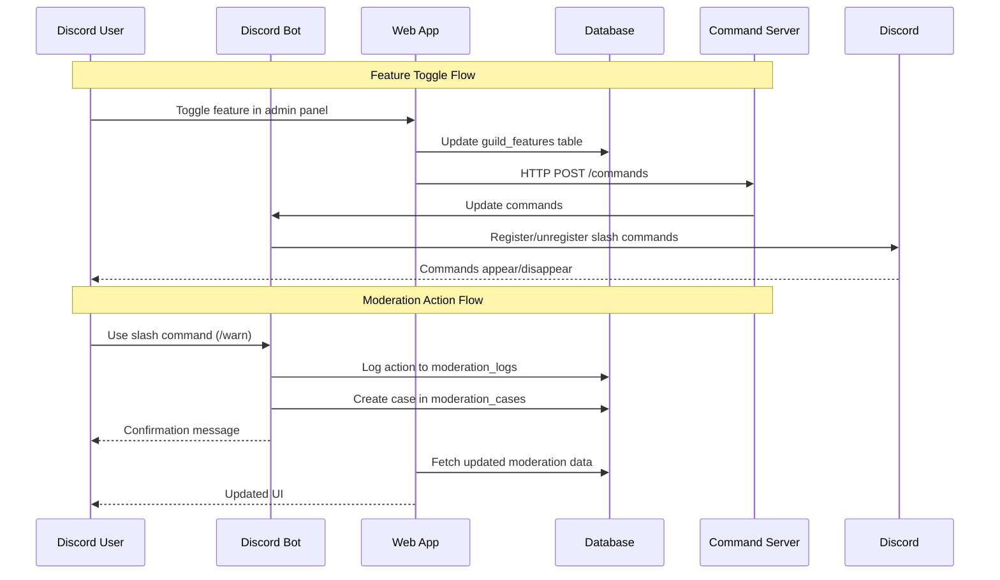
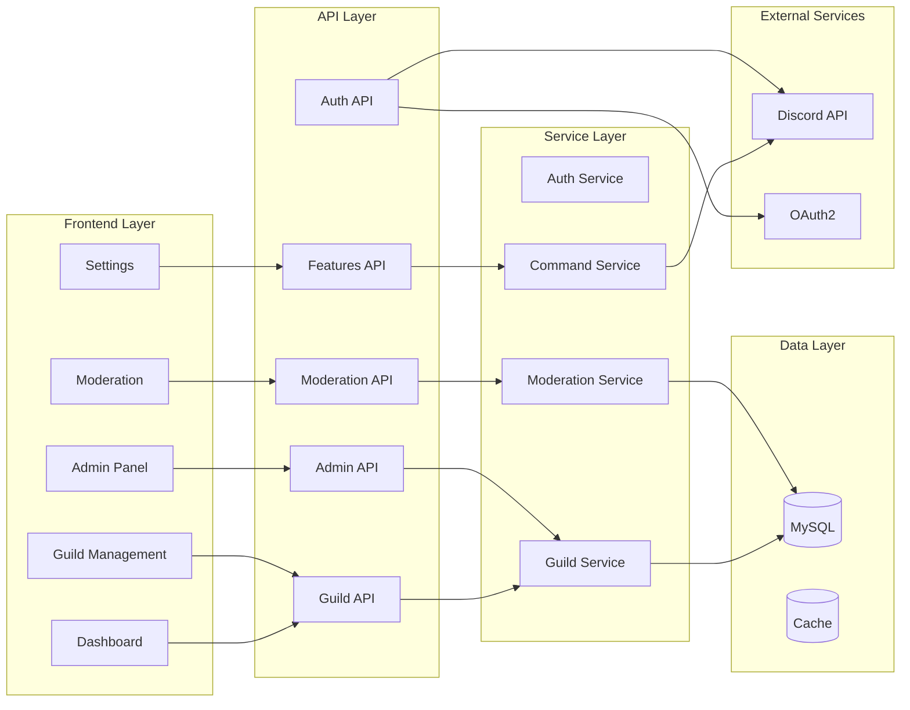
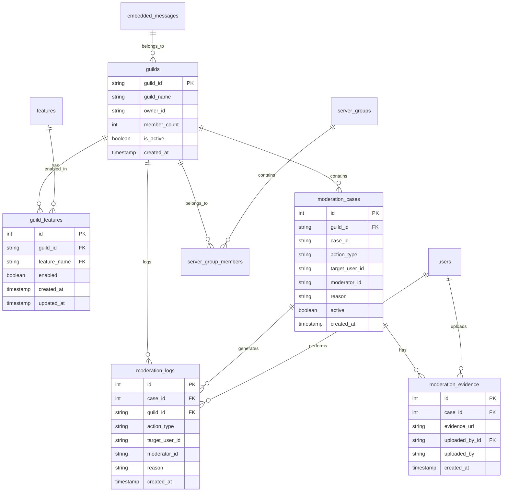
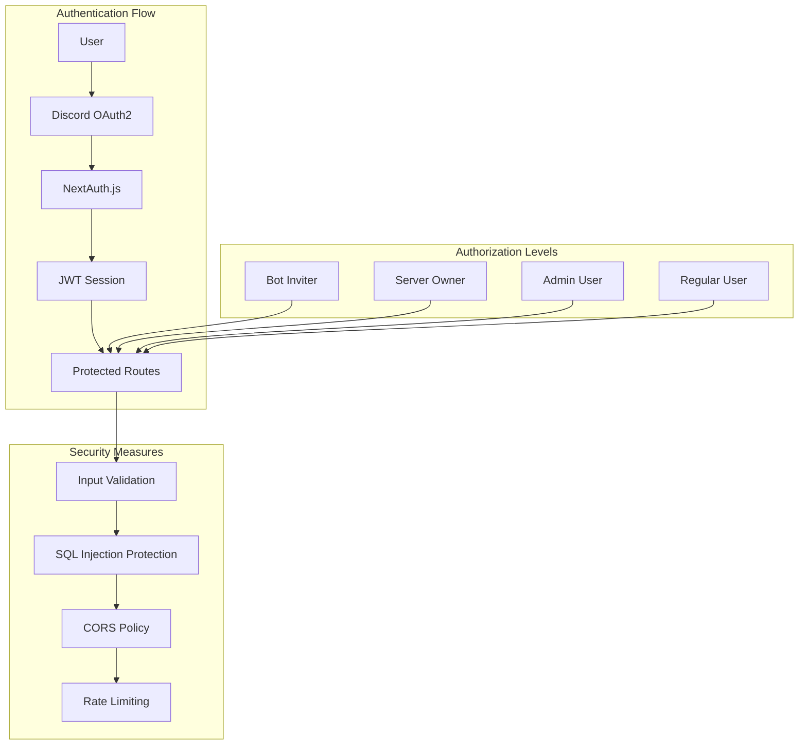
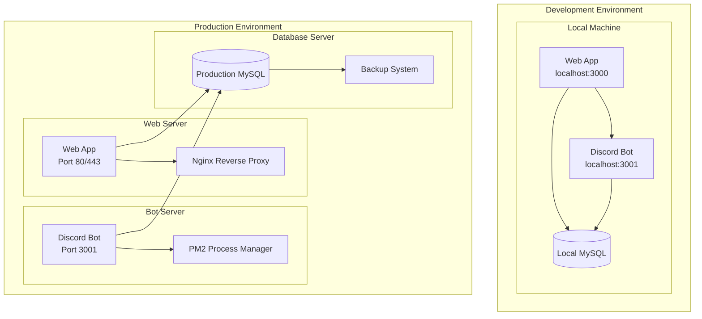
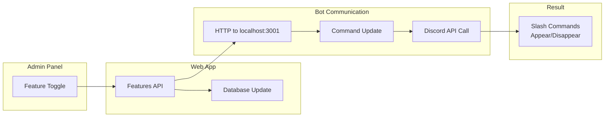
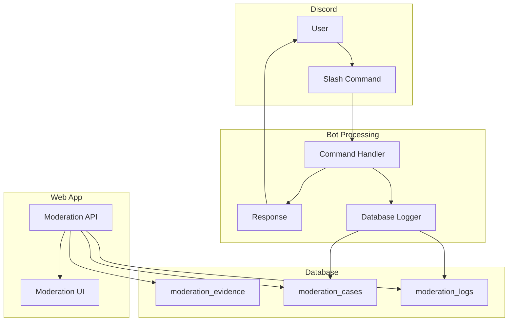

# ServerMate System Architecture Diagram

## High-Level System Overview

## Data Flow Diagram

## Component Architecture

## Database Schema Overview

## Security Architecture

## Deployment Architecture

## Feature Toggle System

## Moderation System Flow

This comprehensive architecture diagram shows the complete ServerMate system design, including data flows, component relationships, security measures, and deployment considerations.
